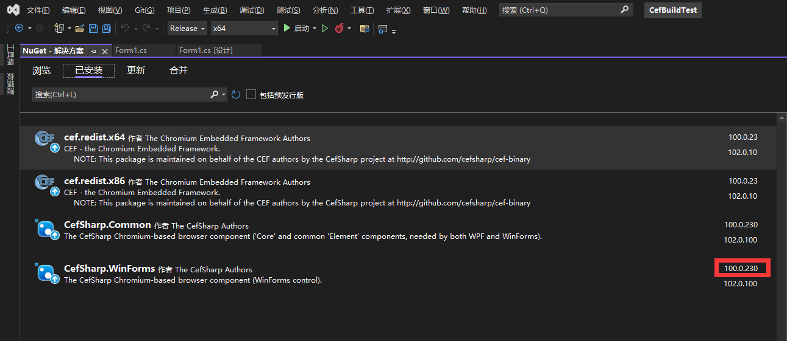
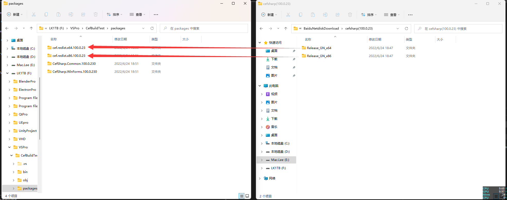

###
Cef 100.0.23 百版稳定包含H.264

人生苦短，快用cefsharp走上软件开发的康庄大道，我个人觉得目前99%的软件都可以使用cef快速开发，高性能模块可以使用cpp,c#进行封装后调用，常规任务可以用H5解决

毕竟office也有网页版，还有obs-studio这种强大的音视频处理软件，adobe也集成了cef来加速开发，腾讯也集成了cef，等等等

写这篇文章在2022年6月，最新版chrome是103，所以目前编译好的100版是很新的，经过几个功能测试之后，并未发现bug

后期如果需要自行编译升级，可以看此仓库所带的两个html，下载之后用浏览器打开html就可以

如果本文对你有帮助，右上角给个star哦

首先新建工程，安装的时候直接安装第四个，NuGet会自动安装前三个依赖包。

注意事项请<<关于cefsharp的坎坷之路>>基本上我遇到的问题，在里面都提到了，虽然我很后悔没有早看到吧。

安装完后

在文件浏览器中打开项目文件夹

覆盖安装完之后，即可编译生成

可以访问 https://html5test.com 进行测试

以上就是cef开发的全流程，即使没有别人发布的包，也可以自己编译，做到完全自主可控，走上一月一大版本，一周一小版本的快速开发。占领商业先机。